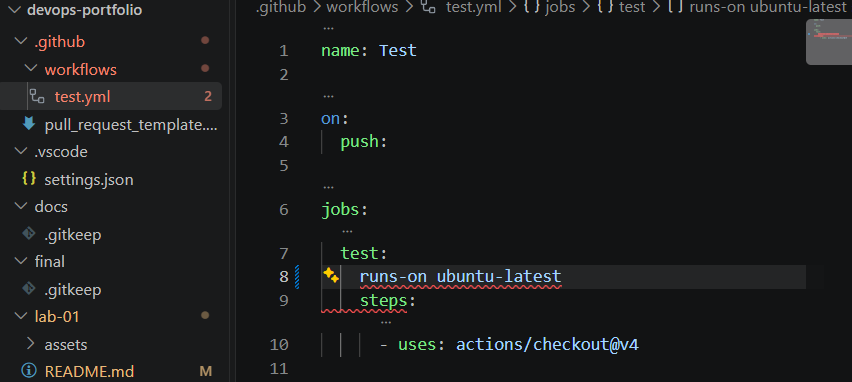

# Звіт з Лабораторної роботи №1

## Завдання 1. Git і редактор

### Глобальні параметри Git
Для роботи з Git було налаштовано такі глобальні параметри. Перевірка командою `git config --list --global` повернула:
```ini
user.name=Kate Penziy
user.email=katepenziy10@gmail.com
core.autocrlf=true
core.editor=code --wait
init.defaultbranch=main
pull.rebase=true
```

user.name та user.email записуються в метадані кожного коміту, вказуючи його автора. Електронна адреса має збігатися з тією, що підтверджена на GitHub, інакше коміти не будуть прив'язані до профілю.

init.defaultBranch=main задає сучасний стандарт назви головної гілки (main) замість застарілої master для всіх нових репозиторіїв.

core.editor=code --wait встановлює Visual Studio Code як редактор за замовчуванням для повідомлень Git. Ключ --wait змушує Git чекати, поки файл у редакторі не буде закрито.

Налаштування core.autocrlf
Різні операційні системи по-різному позначають кінець рядка. Windows використовує CRLF, а Unix/Linux/macOS — LF.
Значення core.autocrlf=true (оптимальне для Windows) автоматично перетворює LF на CRLF під час завантаження коду на комп'ютер, і нормалізує їх назад у LF під час створення коміту. Якщо не налаштувати цей параметр у команді зі змішаними ОС, Git сприйматиме різницю у невидимих символах як зміну всього файлу, що призведе до конфліктів.

Налаштування pull.rebase
Параметр pull.rebase=true змінює стандартну поведінку git pull. Замість створення зайвого merge-коміту при злитті гілок, він тимчасово «відкладає» локальні коміти, завантажує зміни з сервера, а потім застосовує локальні коміти поверх них. Це дозволяє зберегти історію Git чистою та лінійною.

Налаштування VS Code та EditorConfig
Для комфортної роботи з інфраструктурним кодом встановлено такі розширення:

EditorConfig for VS Code — для підтримки файлів конфігурації форматування.

GitLens — для перегляду історії комітів та авторства рядків.

Docker — для підсвічування синтаксису контейнерів.

YAML (від Red Hat) — для валідації синтаксису конфігурацій.

Створений файл .editorconfig гарантує, що всі учасники команди матимуть однакові відступи, кодування та завершення рядків, незалежно від їхніх налаштувань редактора.

Перевірка YAML:
Для демонстрації валідації було створено файл із навмисно пропущеною двокрапкою. Розширення успішно підсвітило помилку ще до коміту.


EditorConfig
У корені репозиторію створено файл .editorconfig з такими налаштуваннями:
```ini
root = true

[*]
charset = utf-8
end_of_line = lf
insert_final_newline = true
indent_style = space
indent_size = 2
trim_trailing_whitespace = true

[*.md]
trim_trailing_whitespace = false
```
Файл задає єдині правила форматування: кодування UTF-8, закінчення рядків LF, відступ у 2 пробіли та фінальний перенос рядка.

Завдання 2. Середовища виконання
Node.js
fnm 1.39.0

Через fnm установлено актуальну LTS Node.js 24.20.0 (Krypton) і попередню LTS 22.23.2 (Jod). Актуальну LTS задано версією за замовчуванням:
* v22.23.2
* v24.20.0 default
* system


У корені репозиторію створено .node-version зі значенням 24.20.0. Разом із fnm --use-on-cd цей файл автоматично вибирає потрібну версію Node.js під час переходу до каталогу проєкту.

До користувацького профілю PowerShell без перезапису інших налаштувань додано ініціалізацію fnm. Перевірка в новій сесії з актуальним PATH автоматично активувала Node.js 24.20.0 із середовища менеджера.

Демонстрація перемикання версій Node.js
Перемикання між двома реально встановленими версіями дало такі результати:

Після демонстрації активною та стандартною знову стала актуальна LTS 24.20.0. Перевірка Get-Command node підтвердила запуск node.exe із середовища fnm_multishells, а не лише із системної інсталяції.

Python і менеджер версій

Для керування Python установлено uv:
uv 0.12.10 (3c979abda 2026-09-04 x86_64-pc-windows-msvc)

Python 3.14.7 встановлений та запускається через uv. Перевірка версії виконується командою:

uv run python --version
Результат:

Python 3.14.7

Docker і Compose v2
Фактичні результати перевірки:


docker --version перевіряє наявність і версію клієнта Docker CLI. Команда docker compose version підтвердила інтегрований Compose plugin v2.34.0. Він запускається правильною командою docker compose з пробілом, а не застарілою окремою командою docker-compose. docker info успішно отримав серверну інформацію, отже Docker Engine запущений. Для доступу до працюючого Engine активний контекст Docker змінено із застарілого desktop-linux на default

Версії інструментів
Для перевірки середовища було виконано:

fnm --version:fnm 1.39.0
fnm list: * v22.23.2
* v24.20.0 default
* system
node --version: v24.20.0
npm --version: 11.19.0
uv --version: uv 0.12.10 
uv run --python 3.14.7 python --version: Python 3.14.7
docker --version: 28.0.4/Server: 4.40.0 
docker compose version: Docker Compose version v2.34.0

Завдання 3. GitHub і доступ
Профіль GitHub
Профіль GitHub із заповненим профілем: ім'я, фото, короткий опис

Для захисту облікового запису було увімкнено двофакторну автентифікацію (2FA) за допомогою застосунку Google Authenticator. Recovery codes збережено окремо в безпечному місці.

SSH-доступ
Для автентифікації на GitHub було створено SSH-ключ типу ed25519, захищений парольною фразою.

Публічну частину SSH-ключа було додано до GitHub-акаунта. Приватна частина ключа зберігається лише локально та не передається до GitHub або репозиторію.


Безпека приватного ключа
Приватний ключ є цифровим підписом власника. Його категорично заборонено додавати в репозиторій (навіть приватний), оскільки він може назавжди залишитися в історії комітів.

Дії у разі витоку приватного ключа:

1. Негайно видалити відповідний публічний ключ у налаштуваннях GitHub (SSH keys).

2. Вважати ключ скомпрометованим і більше ніколи не використовувати.

3. Згенерувати нову пару ключів з новою парольною фразою.

4. Якщо ключ потрапив у Git — повністю вичистити історію репозиторію (через BFG або filter-branch), а не просто видалити файл новим комітом.

5. Перевірити Security Log на GitHub на наявність підозрілої активності.

Завдання 4. Репозиторій-портфоліо
-Створено публічний репозиторій devops-portfolio.

-У корені оформлено README.md із професійними цілями та стеком технологій.

-Згенеровано .gitignore через сервіс gitignore.io (для macOS, Windows, Node.js, Python).

Завдання 5. Правила репозиторію та Project
Захист гілки main (Rulesets)
Для гілки main створено правило захисту (Branch ruleset):

Require a pull request before merging: Всі зміни повинні проходити рев'ю через PR.

Require linear history: Заборонено merge-коміти, що заплутують історію.

Block force pushes: Заборонено переписувати історію головної гілки.

Restrict deletions: Гілку main неможливо випадково видалити.
